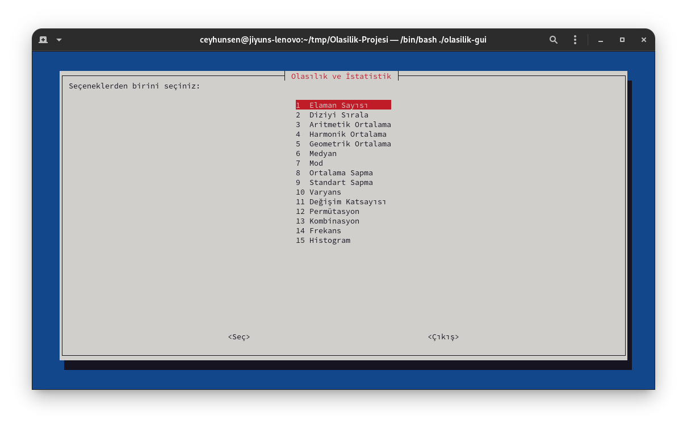

# MAT0293 Olasılık ve İstatistik Projesi

## Hızlı Erişim

1. [Proje Açıklaması](#proje-açıklaması)
2. [Proje Grubu](#proje-grubu)
3. [Kullanılabilir Formüller](#kullanılabilir-formüller)
4. [Kurulum](#kurulum)
	1. [Linux](#linux)
	2. [Windows](#windows)
	3. [Mac OS X](#mac-os-x)
1. [Kullanım](#kullanım)
1. [Lisans](#lisans)

---


## Proje Açıklaması

Bu proje: komut satırı tabanlı, matematiksel formülleri hesaplayabilecek ve diğer olasılık ve istatistik projelerinize entegre edebileceğiniz harici bir programdır. Proje `C` dili ile yazılıp, [GNU getopt](https://www.gnu.org/software/libc/manual/html_node/Getopt.html) kütüphanesi kullanılmıştır.  
Bu proje BTÜ MAT0293 Olasılık ve İstatistik dersi için hazırlanmıştır.


## Proje Grubu

* [Ali Cüneyt Çağlar](https://github.com/CuneytCaglar)
* [Ali Furkan Demir](https://github.com/AliFurkanDemir)
* [Ceyhun Şen](https://github.com/ceyhunsen)
* [Halil Karataş](https://github.com/hll-krts)
* [İbrahim Yahya Aydınlı](https://github.com/ibrahimyahyaaydinli)


### Kullanılabilir Formüller

1. Elaman Sayısı
1. Dizi Sıralama
1. Aritmetik Ortalama
1. Harmonik Ortalama
1. Geometrik Ortalama
1. Medyan
1. Mod
1. Ortalama Sapma
1. Standart Sapma
1. Varyans
1. Değişim Katsayısı
1. Permütasyon
1. Kombinasyon
1. Verilen Sınıf ile Frekans Hesaplama

## Kurulum

**Derleyici olarak `gcc` kullanılması zorunludur!**  
Eğer sisteminizde `gcc` derleyicisi bulunmuyorsa [releases](https://github.com/Kizlar-Grubu-Proje-Yapiyor/Olasilik-Projesi/releases) sayfasından işletim sisteminize uygun çalıştırılabilir dosyayı indirebilirsiniz.

### Linux

### Debian Tabanlı Linux Dağıtımları (Ubuntu, Debian, Pop!_OS, Linux Mint...)

```bash
sudo apt-get install -y gcc make whiptail git
git clone https://github.com/Kizlar-Grubu-Proje-Yapiyor/Olasilik-Projesi.git
cd Olasilik-Projesi
make build
```

### Red Hat Tabanlı Linux Dağıtımları (Fedora Linux, Cent OS, RHEL...)

```bash
sudo dnf install -y gcc make newt git
git clone https://github.com/Kizlar-Grubu-Proje-Yapiyor/Olasilik-Projesi.git
cd Olasilik-Projesi
make build
```

### Windows

Repo'yu indirdiğiniz dizinde `cmd` veya `powershell` açıp aşağıdaki komutu giriniz:

```powershell
gcc src/* -I include -lm -O3 -o olasilik
```

### Mac OS X

Sisteminizde `make`, `gcc`, ve `git` yüklü ise:

```bash
git clone https://github.com/Kizlar-Grubu-Proje-Yapiyor/Olasilik-Projesi.git
cd Olasilik-Projesi
make build
```

Eğer `make` ve `git` yüklü değil fakat `gcc` yüklü ise repo'yu indirdiğiniz dizinde:

```bash
gcc src/* -I include -lm -O3 -o olasilik
```

Kodun Mac OS X'de test edilmesinde ve çalıştırılabilir dosyanın oluşturulmasında destek oldukları için [Kağan Kağanoğlu](https://github.com/kagankaganoglu) ve [Ekrem Bal](https://github.com/ekrembal)'a teşekkür ederiz.


## Kullanım

Genel kullanım:

```bash
./olasilik --[SECENEK] [DEGER(LER)]
```

Aritmetik ortalama için örnek kullanım:

```bash
# Sayılar argüman olarak verilmek istenirse:
./olasilik --aritmetik-ortalama 12 13 800 58624
# Çıktı olarak `14862.250000` yazar

# Sayılar dosyadan okunmak istenirse:
./olasilik --dosya girdi.txt --aritmetik-ortalama
# `girdi.txt` dosyasındaki sayıların aritmetik ortalamasını yazar

# Sayılar stdin'den okunmak istenirse
./olasilik --interaktif --aritmetik-ortalama
# stdin'den okunan sayıların aritmetik ortalamasını yazar
```

Bütün seçenekleri görmek veya yardım almak için `--yardim` bayrağını kullanabilirsiniz:

```bash
./olasilik --yardim
```

Ayrıca sisteminizde `bash` ve `whiptail` yüklü ise önyüzü de kullanabilirsiniz:

```bash
./olasilik-gui
```



## Lisans

[GNU General Public License v3.0](LICENSE)  

**Lütfen kodu lisansa uygun kullanın!**
